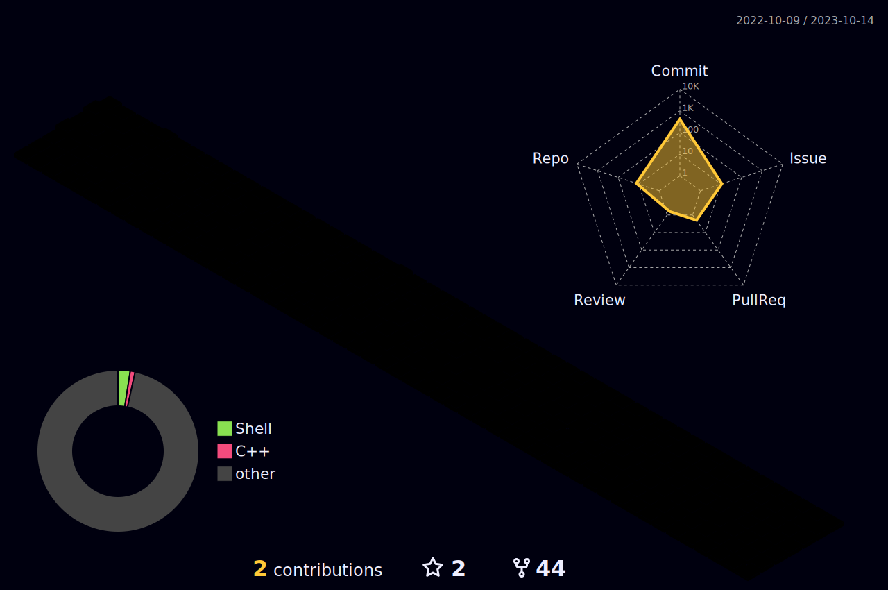

### Welcome to my GitHub page 👋

## ⚡ Used from

## ⚡ Tec Stacks

  

## 🌎 Find me
- Telegram Official Account: search **HO3HSIYAH**✍🏾
- Telegram Official Channel [ZedLicense](https://t.me/ZedLicense/):memo:    
- email:<a href="mailto:zedlicense@gmail.com">ZedLicense@Gmail.com</a>:e-mail:
## 🚀 Blog Posts
<!-- BLOG-POST-LIST:START -->
- [How does Shared License system work?](https://github.com/ZedLicense/ZedLicense-System#zedlicense-system)
- [Wiki-ZedLicense-System](https://github.com/ZedLicense/ZedLicense-System/wiki)
<!-- BLOG-POST-LIST:END -->

